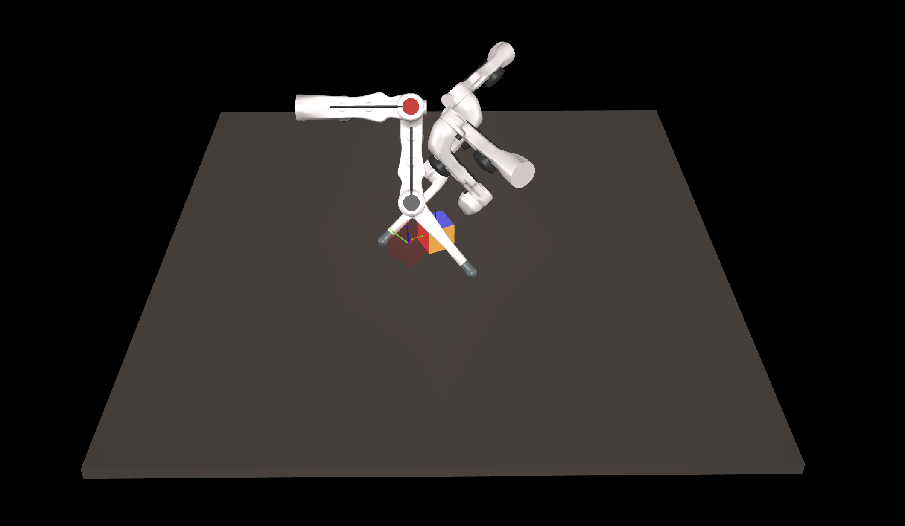

# trifinger-mujoco
An gym-like environment consists of trifinger robot and a cube



## Installation

### Mujuco installation

- Step 1: Download Mujoco 2.10 from this [link](https://github.com/deepmind/mujoco/releases/download/2.1.0/mujoco210-linux-x86_64.tar.gz)
- Step 2: Unzip and copy folder `mujoco210` to under folder `~/.mujoco/` (create this folder if it doesn't exist)
- Step 3: Add this line `export LD_LIBRARY_PATH=$LD_LIBRARY_PATH:/home/{your_user_name}/.mujoco/mujoco210/bin` to your `~/.bashrc` or `~/.zshrc` file

### Mujoco test
To ensure Mujoco is installed properly, run the command `./mujoco/mujoco210/bin/simulate {path_to_this_repo}/trifinger_mujoco/models/trifinger_with_cube_torque_ctrl.xml`

### Trifinger-mujoco installation
To install, under the package's folder, run `pip install -e .`. It will install all necessary packages.

## API

Here's an example using the "Trifinger-v0" environment:

```python
import trifinger_mujoco
import gym
import numpy as np

env = gym.make("Trifinger-v0")
observation = env.reset()
env.render()

for _ in range(1000):
    action = np.random.uniform(low=-0.3, high=0.3, size=9)
    observation, reward, done, info = env.step(action)
    env.render()

    if done:
        break

env.close()
```

## Contributions

- STL files of trifinger are obtained from [trifinger_simulation](https://github.com/open-dynamic-robot-initiative/trifinger_simulation)
- Math utility functions are based on package [baldor](https://github.com/crigroup/baldor) by Francisco Suárez Ruiz
